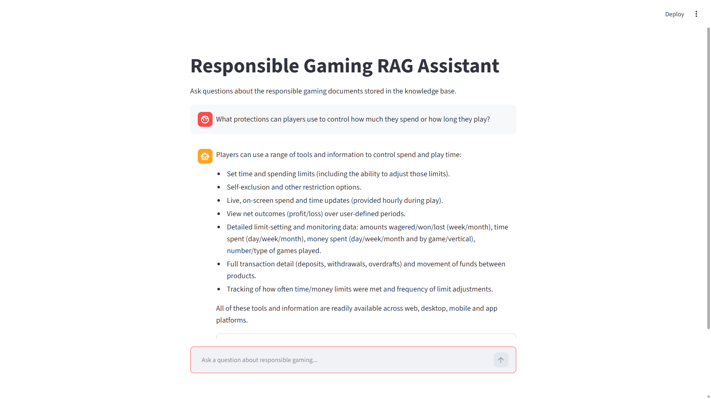
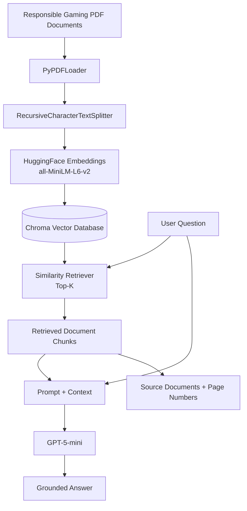

# Responsible Gaming RAG Assistant

A Retrieval-Augmented Generation (RAG) application for answering questions from responsible gaming documents.

The project uses LangChain, ChromaDB, Hugging Face embeddings, and OpenAI models to retrieve relevant document context and generate grounded answers with source information.

## Application Demo



## Features

- Multi-document PDF ingestion
- Recursive text chunking with overlap
- Hugging Face sentence-transformer embeddings
- Persistent ChromaDB vector storage
- Semantic similarity retrieval
- Source and page metadata tracking
- Duplicate-safe document ingestion
- SHA-256 based document change detection
- Conversational question rewriting for follow-up questions
- Grounded answer generation
- Abstention when retrieved context is insufficient
- Streamlit chat interface
- Automated RAG evaluation pipeline

## Architecture



## Tech Stack

- Python
- LangChain
- ChromaDB
- Hugging Face Sentence Transformers
- OpenAI API
- PyPDF
- Streamlit
- uv

## Retrieval Configuration

- Embedding model: `sentence-transformers/all-MiniLM-L6-v2`
- Chunk size: `500`
- Chunk overlap: `100`
- Production retrieval: similarity search
- Top K: `3`
- Vector database: ChromaDB
- Collection: `responsible_gaming`

## Evaluation

The project includes a consolidated evaluation pipeline covering retrieval and generation quality.

### Current Evaluation Results

| Metric | Result |
|---|---:|
| Hit@1 | 88.9% |
| Hit@3 | 88.9% |
| Hit@5 | 100.0% |
| Answer test pass rate | 100.0% |
| Abstention test pass rate | 100.0% |
| Faithfulness | 100.0% |
| Answer relevance | 83.3% |

These results are based on the project's current small evaluation datasets and should not be interpreted as general accuracy guarantees.

## Retrieval Experiments

Several retrieval strategies were evaluated rather than automatically added to the production pipeline.

### Chunk Size

Tested chunk sizes:

- 500 characters
- 800 characters
- 1200 characters

The 500-character configuration performed best in the controlled single-document Hit@3 experiment and improved top-rank retrieval in the production knowledge base.

### Maximum Marginal Relevance

MMR retrieval was compared with standard similarity retrieval.

Both achieved:

`Hit@3 = 88.9%`

Because MMR did not improve the measured result, similarity retrieval was retained.

### Query Rewriting

LLM-based query rewriting successfully improved retrieval for some paraphrased questions, including a difficult self-exclusion query.

However, it degraded retrieval for another previously successful question.

Overall:

`Original Hit@3 = 88.9%`

`Rewritten Hit@3 = 88.9%`

Therefore, query rewriting was not applied globally to standalone retrieval queries.

Conversational rewriting is still used to convert follow-up questions into standalone questions when conversation history is required.

## RAG Evaluation

The evaluation pipeline measures different parts of the system separately.

```text
Question
   |
   v
Retriever --------> Hit@K
   |
   v
Retrieved Context
   |
   v
LLM
   |
   +-------------> Faithfulness
   |
   +-------------> Answer Relevance
   |
   +-------------> Expected Facts
   |
   +-------------> Abstention
   |
   v
Final Answer
```

This separation helps distinguish retrieval failures from generation failures.

For example, one paraphrased long-term gambling restriction question failed to retrieve the expected self-exclusion evidence at K=3. The model abstained rather than generating unsupported information. The answer was therefore judged faithful but not relevant to the user's information need.

## Running the Project

Install dependencies:

```bash
uv sync
```

Create a `.env` file and add:

```env
OPENAI_API_KEY=your_api_key
```

Ingest PDFs:

```bash
uv run python ingest.py
```

Run the command-line assistant:

```bash
uv run python app.py
```

Run the Streamlit application:

```bash
uv run streamlit run streamlit_app.py
```

Run the evaluation suite:

```bash
uv run python evaluate.py
```

## Project Structure

```text
Lchain/
├── data/
├── tests/
│   ├── experiments/
│   ├── evaluation_questions.json
│   └── answer_evaluation.json
├── src/
│   └── rag_app/
│       ├── config.py
│       ├── ingestion.py
│       ├── retrieval.py
│       └── chains.py
├── ingest.py
├── app.py
├── streamlit_app.py
├── evaluate.py
├── pyproject.toml
├── uv.lock
├── .env.example
├── .gitignore
└── README.md
```

## Known Limitations

- The current evaluation datasets are small.
- Retrieval can fail on some indirect or highly paraphrased questions.
- Keyword-based answer evaluation is sensitive to changes in LLM wording.
- LLM-as-a-judge evaluation can vary and depends on the quality of the evaluation rubric.
- File hashing detects PDF changes but currently does not detect changes to ingestion configuration such as chunk size.
- Increasing Top K can improve retrieval recall while also introducing additional context.

## Future Improvements

- Expand the evaluation dataset.
- Add stronger semantic answer evaluation.
- Add ingestion configuration versioning.
- Evaluate alternative embedding models.
- Investigate hybrid retrieval and reranking.
- Improve source presentation in the Streamlit interface.
- Add automated tests and deployment.